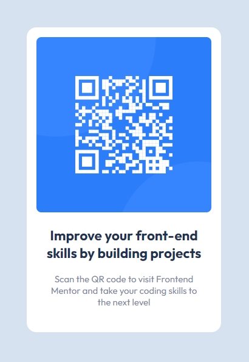

# Frontend Mentor - QR code component solution

This is a solution to the [QR code component challenge on Frontend Mentor](https://www.frontendmentor.io/challenges/qr-code-component-iux_sIO_H). Frontend Mentor challenges help you improve your coding skills by building realistic projects.

## Table of contents

- [Overview](#overview)
  - [The challenge](#the-challenge)
  - [Screenshot](#screenshot)
  - [Links](#links)
- [My process](#my-process)
  - [Built with](#built-with)
  - [How to install and run](#how-to-install-and-run)
- [Author](#author)

## Overview

### The challenge

Users should be able to:

- View the optimal layout depending on their device's screen size

### Screenshot



### Links

- Solution URL: [Github](https://github.com/cekstedt/FEM-QR-Code-Component)
- Live Site URL: [Netlify](https://shimmering-piroshki-6e2004.netlify.app/)
- Challenge URL: [Frontend Mentor](https://www.frontendmentor.io/challenges/qr-code-component-iux_sIO_H)

## My process

### Built with

- Semantic HTML5 markup
- CSS custom properties

### How to install and run

This project is HTML & CSS only, so simply clone the repo then open `src/index.html` in your browser.

```
git clone https://github.com/cekstedt/FreeCodeCamp-Rothko-Painting.git
```

## Author

- Frontend Mentor - [@cekstedt](https://www.frontendmentor.io/profile/cekstedt)
